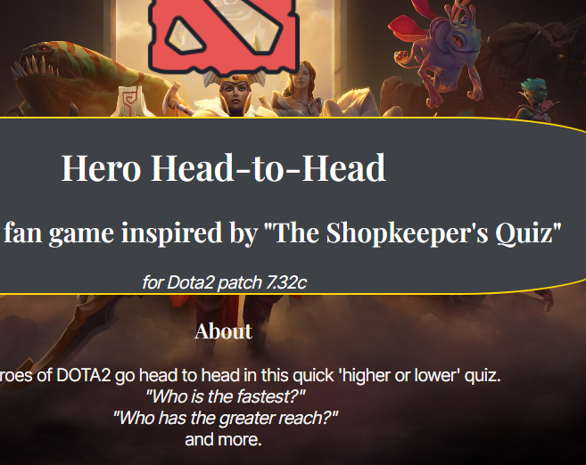
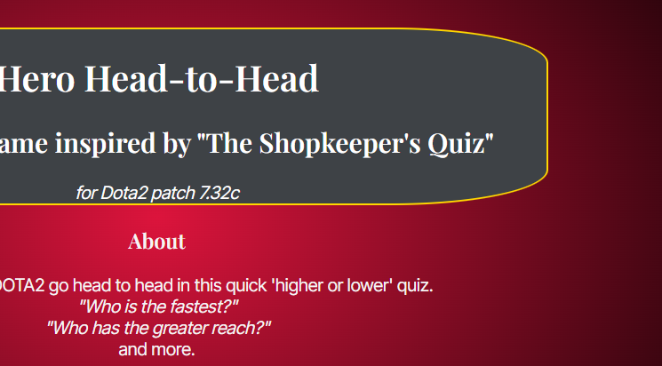
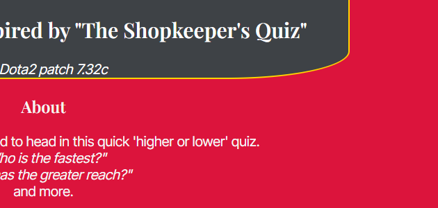
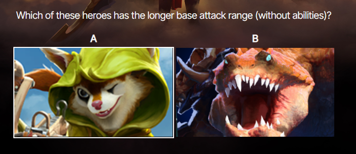

# Code Institute Portfolio Project 2: JavaScript

## Hero Head to Head: A DOTA2 Fan Game

[live web address](https://james-glennon.github.io/Portfolio-project-2--JavaScript/)

*Author: James Glennon*

### About / Design
The function of the design is a general knowledge quiz for fans of [dota 2](https://www.dota2.com/home) comparing two
heros in a head to head.

The two heroes shown should not be identical, and should have different values for the question asked e.g. movement speed.

On loading, the page will automatically generate a question based on the values stored in the javascript.

After answering a question, the browser will alert the user to wether they answered correctly/incorrectly,
before generating another random question.

### Features
The webpage features a background image from the Dota 2 website.

[Live link to Background image](https://cdn.cloudflare.steamstatic.com/apps/dota2/images/dota_react//home/heroes_full.jpg)

A back-up red/black gradient if the image does not load.

And a solid red background should the gradient fails to load.

Two hero images which act as buttons to answer the question on screen.
The images show a white border when hovered over.

### Development and Testing

#### Links

#### Browsers

#### Bugs

#### Validators and LightHouse

### Deployment

### Credits

#### Media

#### Coding