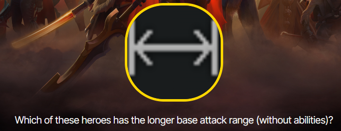
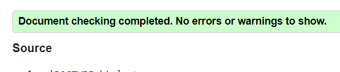
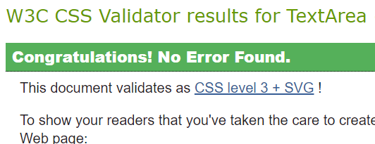

# Code Institute Portfolio Project 2: JavaScript

## Hero Head to Head: A DOTA2 Fan Game

[live web address](https://james-glennon.github.io/Portfolio-project-2--JavaScript/)

*Author: James Glennon*

### About / Design
The function of the website is a general knowledge quiz for fans of [dota 2](https://www.dota2.com/home) 
comparing two heros in a head to head.

The two heroes shown should not be identical, and should have different values for the question asked e.g. movement speed.

On loading, the page will automatically generate a question based on the values stored in the javascript.

After answering a question, the browser will alert the user to wether they answered correctly/incorrectly,
before generating another random question.

The data used for questions is stored in a large array which passes through a function to become an array
of objects / dictionary.

### Features
The webpage features a background image from the Dota 2 website.

[Live link to Background image](https://cdn.cloudflare.steamstatic.com/apps/dota2/images/dota_react//home/heroes_full.jpg)


A back-up red/black gradient if the image does not load.


And a solid red background should the gradient fails to load.


Question text and image which change based on the question.



Two hero images which act as buttons to answer the question on screen.
The images show a white border when hovered over.


### Development and Testing

#### Links
All links present are to external websites.

all links open in a new tab, at the intended website,
and have aria-labels attached in the html

#### Browsers

#### Bugs

##### Non-exclusive Lists/Arrays

As part of the website functionality, it is important to be able to remove multiple entries from
the heroesArray and heroesObjects without repeats.

This was originally attemped by passing the heroObjects through a for loop,
and splicing the randomly selected entry from the array, preventing repeats.

```
function (num1) {

    let allHeroes = heroesObjects();
    let questionArray = [];

        for (let i = 0; i < num1, i++) {
            let randomEntry = allHeroes[Math.floor(Math.random()*allHeroes.length];
            questionArray.push(randomEntry);
            allHeroes.splice(randomEntry);
        }
}
```

**Where num1 equals the number of random, non-repeating enteries required**

This code did not function as intended and resulted in repeats.

Instead, a while loop was used to:

1. push a randomEntry to the questionArray,
2. select a second randomEntry, and if
3. the entry matched the first, the **continue** function was called for the next loop.
4. if the two did not match, the randomEntry was passed to the questionArray.
5. the loop continued till the questionArray.length was equal to num1.

```
/**
 * Selects a random hero from the createHeroesObjects() array.
 * pushes the selected hero to a randomHeroes array [0].
 * while randomHeroes.length is less than num1,
 * loops through randomEntries till moveSpeed is NOT equal.
 * pushes the NOT equal entry to the randomHeroes array [1].
 * only works for a max of 2 entries.
 * @param {number of random heroes required} num1.
 */
function generateRandomMoveSpeedHeroes(num1) {
    let allHeroes = createHeroesObjects();
    randomHeroes = [];

    let randomEntry = allHeroes[(Math.floor(Math.random() * allHeroes.length))];
    randomHeroes.push(randomEntry);

    while (randomHeroes.length < num1) {
        randomEntry = allHeroes[(Math.floor(Math.random() * allHeroes.length))];

        if (randomEntry.moveSpeed === randomHeroes[0].moveSpeed) {
            continue;
        } else {
            randomHeroes.push(randomEntry);
        }
    }

    return randomHeroes;
};

```

This function appears to prevent repeat entries, however if the number of different values
for the selected variable is less than **num1**, the loop would become infinite and crash the site.


##### Duplicating/Repeating eventListeners

In the script.js file is code for applying eventListeners to the img elements in the html.

```
 /**
     * defines the function that sets the attackRangeQuestion listener for button A.
     */
    let eventListenerA = function () {
        if (questionArray[0].attackRange >= questionArray[1].attackRange) {
            alert(`Correct.
            ${questionArray[0].heroName} has ${questionArray[0].attackRange} attack range,
            while ${questionArray[1].heroName} has ${questionArray[1].attackRange}.`);

            incrementScore(eventListenerA, eventListenerB);

        } else {
            alert(`Incorrect.
            ${questionArray[0].heroName} has ${questionArray[0].attackRange} attack range,
            while ${questionArray[1].heroName} has ${questionArray[1].attackRange}.`);

            incrementWrongAnswer(eventListenerA, eventListenerB);
        }
    };
    questionButtons[0].addEventListener('click', eventListenerA);

```

Previously, the function known as eventListenerA was not assigned to a variable,
nor was the function passed to the increment functions as a parameter.

This would mean that a new eventListener was added to the questionButton without removing
the previous one every time this section was executed.

This would result in the questions looping on themselves in unusual ways,
answering several question with each click.

To counteract this, and removeEventListener function was added to the increment functions,
to remove the previous questions eventListeners before adding new ones.

```
// Copied from Code Institute: Love Maths project
/**
 * Gets the current score from the DOM and increment by 1.
 * additionally removes the previously set eventListeners from button 1 and 2.
 * @param{listenerFunction to be removed from buttonA, listenerFunction to be removed from buttonB}.
 */
function incrementScore(function1, function2) {

    let oldScore = parseInt(document.getElementById('score').innerHTML);
    document.getElementById('score').innerHTML = ++oldScore;


    questionButtons[0].removeEventListener('click', function1);
    questionButtons[1].removeEventListener('click', function2);

    randomQuestionType();
}
```

I have since been told that passing a function as a parameter to another function is
bad practice and 'messy', though I do not have the resources to devise an alternative.

#### Validators and LightHouse
[HTML validator](https://validator.w3.org/#validate_by_input) shows no errors.



[CSS validator](https://jigsaw.w3.org/css-validator/#validate_by_input) shows no errors.



### Deployment

### Credits

#### Media

The data for the heroesArray(), as well as almost all images used were
sourced from the [official Dota2 website](https://www.dota2.com/home).

For the few hero images which were of smaller resolution on the offical site,
the [Dota fandom wiki](https://dota2.fandom.com/wiki/Dota_2_Wiki) was a source of higher resolution alternatives.

The images from the offical site were in .png format, and those from the wiki were in webp format.

The Dota2 icon used at the top of the index.html page was sourced from [icons8](https://icons8.com/icon/CKjh3gr9jo0B/dota-2).

The Dota2 favicon was sourced from [favicon.cc](https://www.favicon.cc/?action=icon&file_id=608998).


#### Coding

The incrementScore() and incrementWrongAnswer() functions were taken directly from the 
[Code Institute](https://codeinstitute.net/ie/) Love Math walkthrough project.

[Convertio file converter](https://convertio.co/) was used to convert .webp images to .png files.

[Stackoverflow questions](https://stackoverflow.com/questions/45723205/removing-duplicate-event-listeners) was used
to address issues regarding repeating eventListeners bugs.

[Markdown guide](https://www.markdownguide.org/cheat-sheet/) was used for writing this readme.md file.

[The W3C Markup Validator](https://validator.w3.org/) was used for testing html code.

[The W3C *Jigsaw* CSS Validator](https://jigsaw.w3.org/css-validator/) was used for testing css code.

[Google Chrome Dev tools](https://developer.chrome.com/docs/devtools/) was used for debugging during development,
and lighthouse was used to measure accessability.